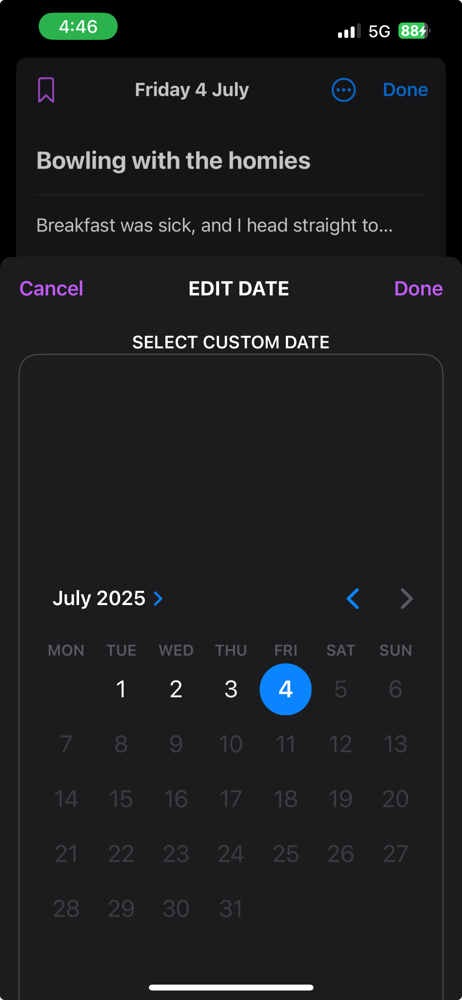
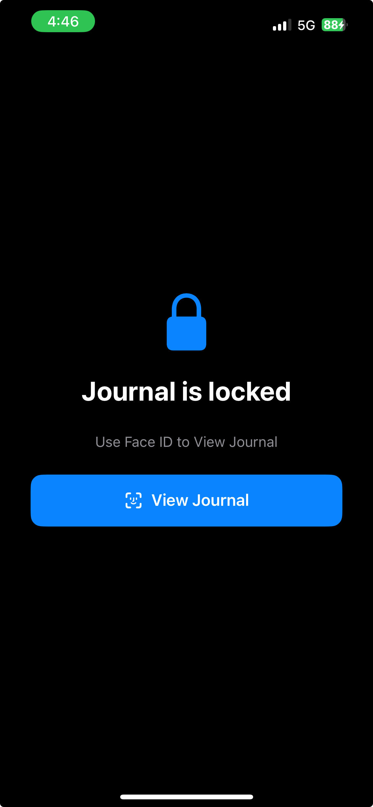

# iPhone Journal App Replica
A SwiftUI-based iOS app inspired by Apple's Journal app.

## About
This project is my first experience in iOS app development. My goal is to learn **Swift**, **SwiftUI**, and the Apple development ecosystem by recreating the core experience of the iPhone’s Journal app. The app is designed to be **simple**, **beautiful**, and **privacy-focused**, with Face ID support and a modern, card-based UI. It was done and tested entirely on Xcode

## Features
 Face ID Lock – Secure your journal with Face ID authentication. 
 Add, Edit, and Delete Entries – Easily manage your journal content.  
 Sort and Search – Sort by date or bookmark; search by keywords.  
 Pictures and Voicenotes - Enriching the entry experience with distinct media. 
 Bookmarks – Mark important entries for quick access.  
 Custom Dates – Assign and edit dates to backdate entries.  
 Responsive Design – Built with SwiftUI for smooth animations and a native iOS feel.

## Getting Started
### 1. Clone the repository:
```bash
git clone https://github.com/yourusername/journal-replica.git
cd journal-replica
```

### 2. Open in Xcode
- Open Journal Replica.xcodeproj in Xcode.

### 3. Run the app
- Select an iOS Simulator or your physical iPhone and click Run.

## Screenshots

### Home Screen


### Add Entry


### Face ID Prompt



## License
This project is licensed under the MIT License. See the [LICENSE](LICENSE) file for details.


